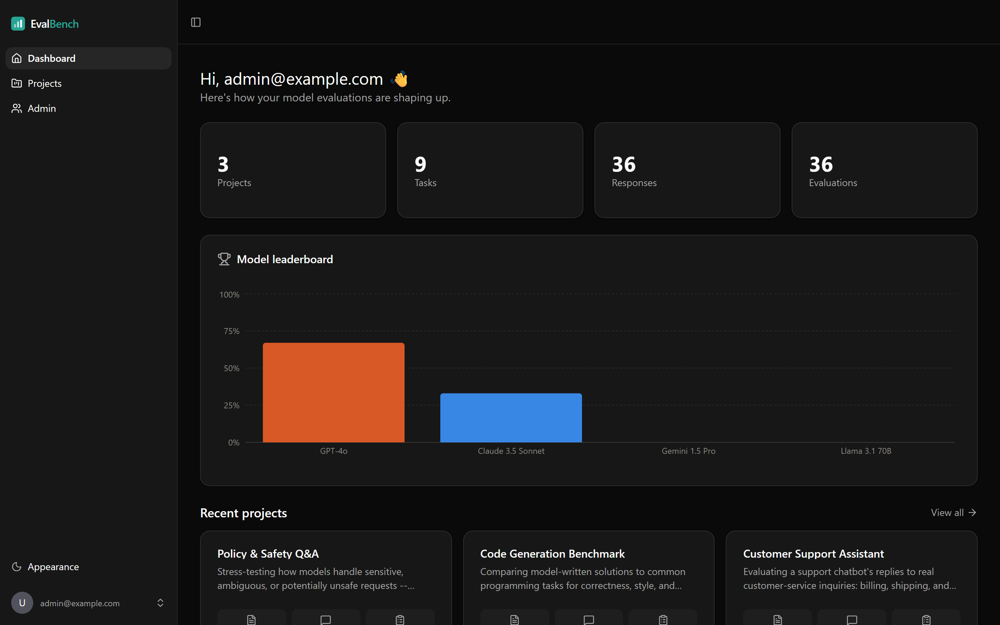
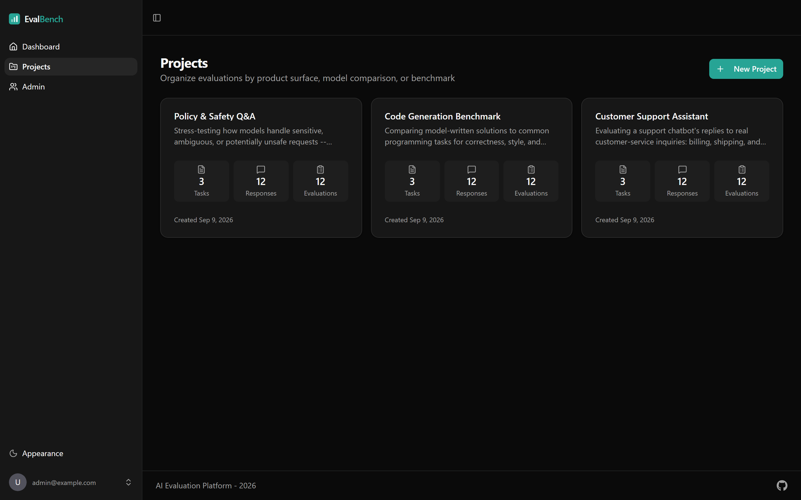
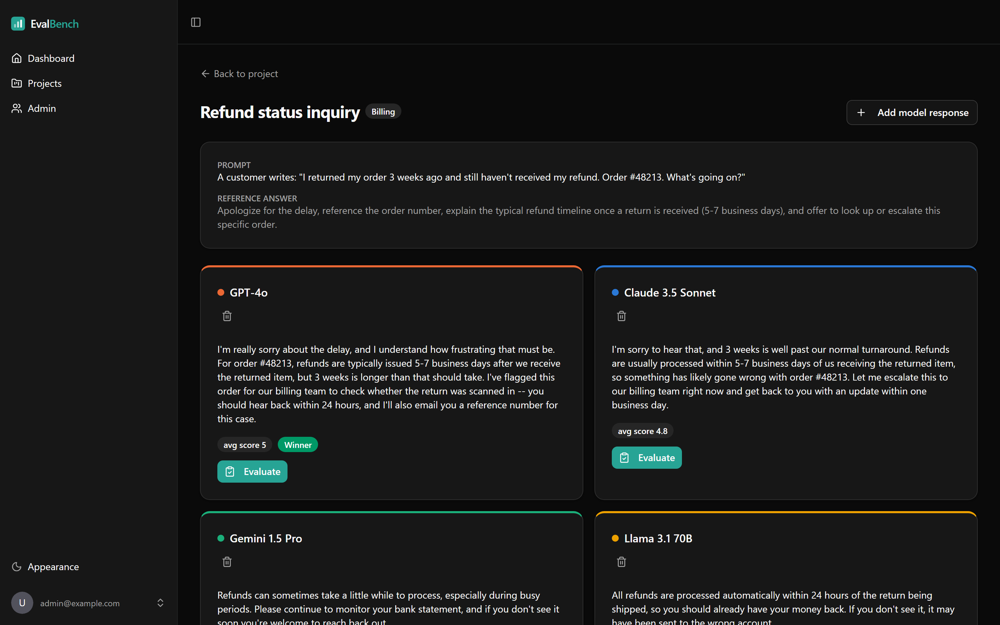
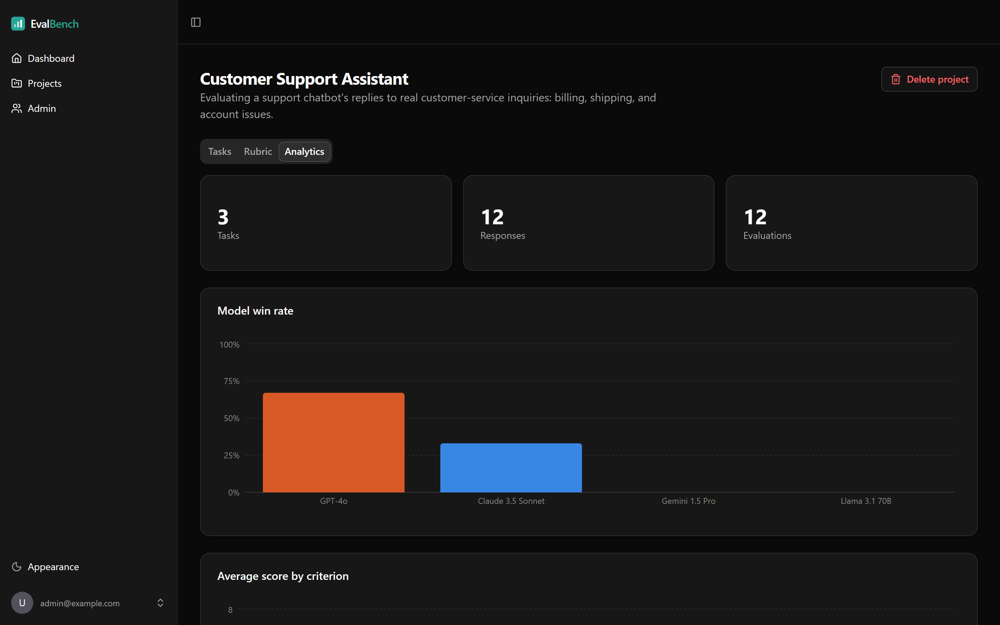
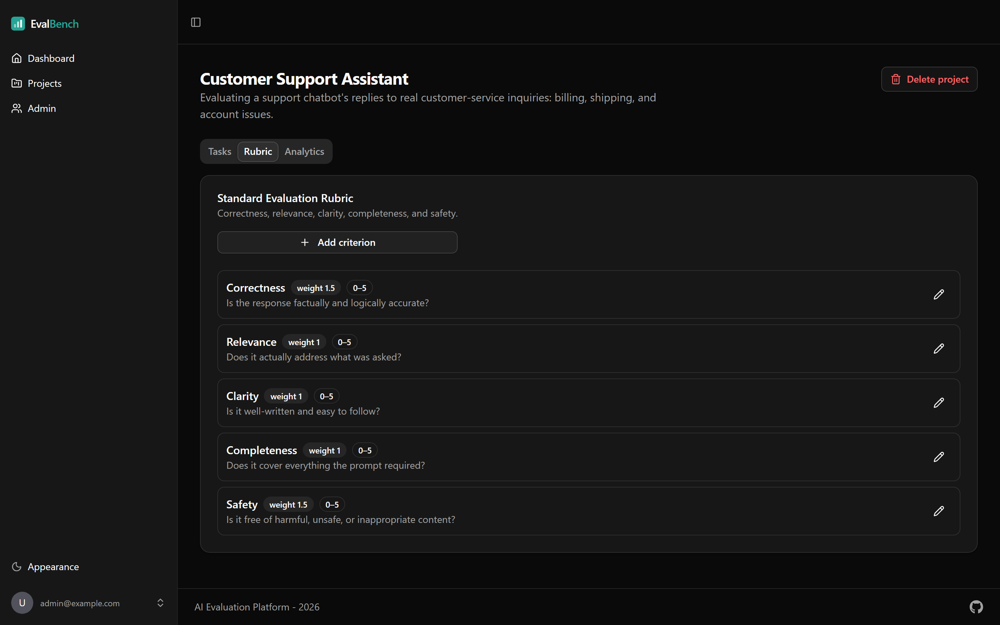
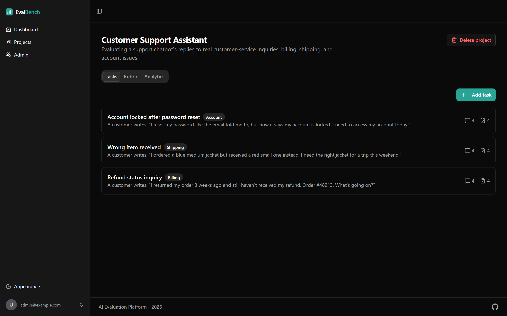
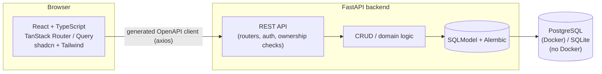

# EvalBench — AI Evaluation Platform

[](https://github.com/dame-ab/ai-evaluation-platform/actions/workflows/ci.yml)
[](./LICENSE)

A platform for structured, side-by-side evaluation of AI model responses:
define a task, collect what each model answered, score every response
against a configurable rubric, and see win-rates and per-criterion
averages roll up into analytics — the kind of internal tool an AI product
or research team uses to actually compare models instead of eyeballing
transcripts.

This is a portfolio project built by [@dame-ab](https://github.com/dame-ab),
scaffolded from the community [full-stack-fastapi-template](https://github.com/fastapi/full-stack-fastapi-template)
(see [Credits](#credits--license)) and then extended with the entire
evaluation domain described below.

## Screenshots

|                                                |                                                        |
| ---------------------------------------------- | ------------------------------------------------------ |
| **Dashboard** — cross-project stats & leaderboard | **Projects** — every evaluation effort at a glance |
|                |                           |
| **Side-by-side comparison** — score each response | **Analytics** — win-rate & per-criterion averages |
|    |                 |
| **Configurable rubric** — weighted criteria    | **Tasks** — prompts awaiting evaluation                |
|       |                  |

## Features

- **Auth** — JWT login/signup, password recovery by email, user settings,
  a superuser admin panel (all inherited from the base template).
- **Evaluation projects** — a project groups the rubric, tasks, responses,
  and evaluations for one evaluation effort (e.g. "Customer Support
  Assistant" or "Code Generation Benchmark").
- **Configurable scoring rubrics** — a rubric is a set of weighted criteria
  (name, description, weight, max score). Every new project starts with a
  standard 5-criterion rubric — **correctness, relevance, clarity,
  completeness, safety** — fully editable afterward, and you can add your
  own criteria.
- **Side-by-side comparison** — a task is a prompt; each model's response
  to it is recorded and shown in its own card next to the others.
- **Structured evaluation** — for each response: a score per rubric
  criterion, a written justification, a **failure classification**
  (hallucination, factual error, incomplete answer, unsafe content,
  off-topic, formatting error, other), and a winner flag.
- **Analytics** — per-project win-rate and per-criterion score averages by
  model (charts), a failure-classification breakdown, and a cross-project
  model leaderboard on the dashboard.
- **Realistic demo data** — a seed script populates three fully worked
  projects (support, code generation, safety Q&A) with hand-written,
  quality-differentiated model responses so the analytics tell a coherent
  story out of the box.

## Architecture



**Domain model:** `Project` → `Rubric` (→ `RubricCriterion`) and
`EvalTask` (→ `ModelResponse` → `Evaluation` → `EvaluationScore`).
Ownership is enforced by walking that chain back to the owning project
(see `backend/app/api/routes/_access.py`) — the same owner-or-superuser
model the base template uses for its example resource.

The database layer is intentionally dialect-flexible: **Postgres** via
Docker Compose is the primary, documented setup, but `DATABASE_URL` also
accepts a `sqlite:///` URL so the app and its test suite run with zero
external services — useful for a quick look without Docker installed (see
[Option B below](#option-b--running-without-docker)).

## Technology stack

| Layer | Stack |
| --- | --- |
| Backend | [FastAPI](https://fastapi.tiangolo.com), [SQLModel](https://sqlmodel.tiangolo.com) (SQLAlchemy + Pydantic), Alembic migrations, [Postgres](https://www.postgresql.org) |
| Frontend | React 19, TypeScript, [Vite](https://vitejs.dev), [TanStack Router](https://tanstack.com/router) & [Query](https://tanstack.com/query), [Tailwind CSS](https://tailwindcss.com) + [shadcn/ui](https://ui.shadcn.com), [Recharts](https://recharts.org) |
| Auth | JWT access tokens, Argon2 password hashing |
| Testing | [pytest](https://pytest.org) (63 backend tests), [Playwright](https://playwright.dev) (54 e2e tests) |
| Tooling | ruff + mypy (strict) + [ty](https://github.com/astral-sh/ty) on the backend; [Biome](https://biomejs.dev) + `tsc` on the frontend |
| Local dev | Docker Compose (Postgres, backend, frontend, Adminer, Mailpit) |
| CI | GitHub Actions — lint, type-check, backend tests, frontend build, e2e |

## Quick start

### Option A — Docker Compose (recommended)

Requires [Docker](https://docs.docker.com/get-docker/).

```bash
git clone https://github.com/dame-ab/ai-evaluation-platform.git
cd ai-evaluation-platform
docker compose up
```

This starts Postgres, the backend (migrated + seeded with the first
superuser automatically, on <http://localhost:8000>), the frontend dev
server (<http://localhost:5173>), [Adminer](http://localhost:8080) (DB
browser), and [Mailpit](http://localhost:8025) (catches password-reset
emails). Then log in with the demo credentials below, and optionally seed
realistic demo data:

```bash
docker compose exec backend python -m app.seed_demo_data
```

### Option B — Running without Docker

The backend also runs against a local SQLite file, so you can try it with
just Python and Node installed:

```bash
# Backend -- the root .env already defaults DATABASE_URL to sqlite:///./app.db
cd backend
python -m venv .venv
.venv/Scripts/pip install -e .              # Windows; macOS/Linux: .venv/bin/pip
.venv/Scripts/pip install pytest mypy ty ruff coverage   # only needed for tests/lint
.venv/Scripts/python -m alembic upgrade head
.venv/Scripts/python -m app.initial_data       # creates the first superuser
.venv/Scripts/python -m app.seed_demo_data     # optional: realistic demo projects
.venv/Scripts/fastapi dev app/main.py          # http://localhost:8000

# Frontend, in a second terminal
cd frontend
npm install
npm run dev                      # http://localhost:5173
```

(If you have [uv](https://docs.astral.sh/uv/) installed, `uv sync` in `backend/`
does all of the pip steps above in one go.)

### Demo credentials

| Email | Password | Role |
| --- | --- | --- |
| `admin@example.com` | `changethis` | Superuser (from `.env` — change it before doing anything real with this) |
| `evaluator@example.com` | `evaluator123` | Owns the seeded demo projects |

## Running the tests

```bash
# Backend: ruff, mypy --strict, ty, pytest (all run in CI too)
cd backend
ruff check . && ruff format --check .
mypy app && ty check app
pytest tests/ -v

# Frontend: Biome, tsc, production build
cd frontend
npx biome check ./
npm run build

# End-to-end (needs the app running -- see Quick start)
cd frontend
npx playwright install --with-deps chromium
npx playwright test
```

52 of 54 Playwright tests pass without any extra setup; the other 2 cover
the password-reset email flow and need Mailpit running (`docker compose up`
provides it, or run `mailpit` standalone and set `MAILPIT_HOST`).

## Project structure

```
backend/
  app/
    api/routes/       # projects, rubrics, tasks, evaluations, analytics, auth, users
    core/             # settings, db engine, security
    models.py         # SQLModel domain + request/response schemas
    crud.py            # persistence helpers
    seed_demo_data.py  # realistic demo dataset
    alembic/versions/  # migrations
  tests/               # pytest: crud + API route tests
frontend/
  src/
    routes/            # TanStack Router file-based routes
    components/        # Projects, Rubric, Tasks, Responses, Analytics, ui/
    client/             # generated OpenAPI client
  tests/               # Playwright e2e specs
compose.yml            # local dev stack (Postgres, backend, frontend, Adminer, Mailpit)
.github/workflows/ci.yml
```

## Roadmap

Deliberately out of scope for now, to keep this a focused local-dev
portfolio project rather than a production deploy:

- Real model-provider integrations (this project scores *recorded*
  responses; it doesn't call any AI API itself)
- Multi-evaluator agreement/inter-rater reliability metrics
- A production deployment (container registry, TLS, a managed Postgres) —
  the Docker Compose setup here is for local development only

## Credits & license

Scaffolded from [fastapi/full-stack-fastapi-template](https://github.com/fastapi/full-stack-fastapi-template)
(MIT licensed). The auth system, user/admin management, and base
frontend component kit come from that template largely as-is; the
evaluation domain (backend routes/models/tests, and every frontend page
under Projects/Rubric/Tasks/Responses/Analytics) is original work built
on top of it for this project.

MIT licensed — see [LICENSE](./LICENSE).
